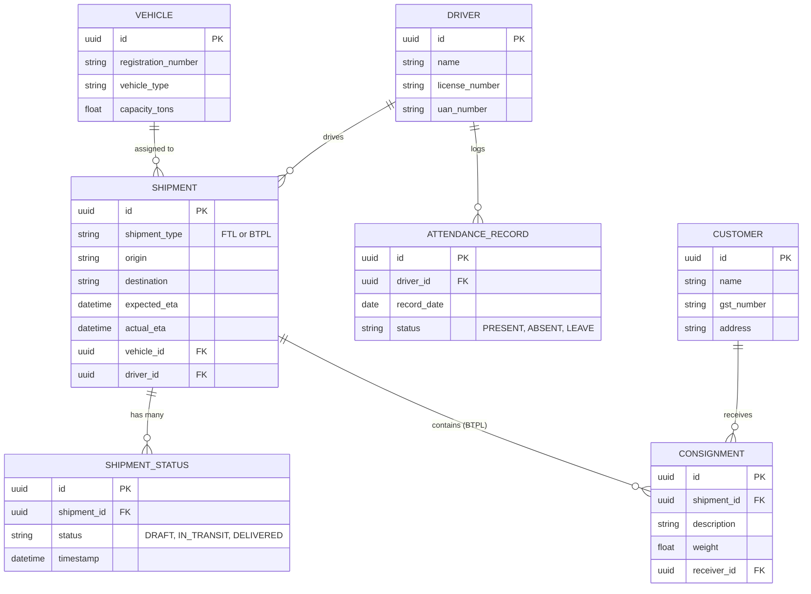
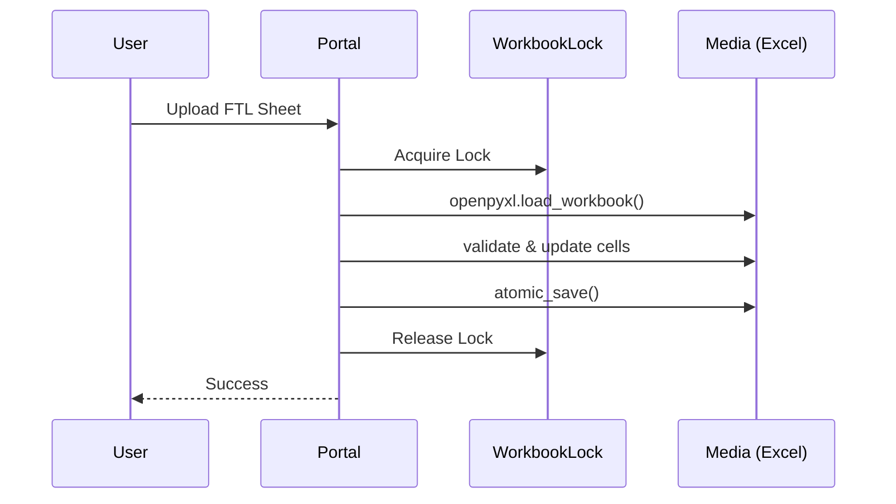
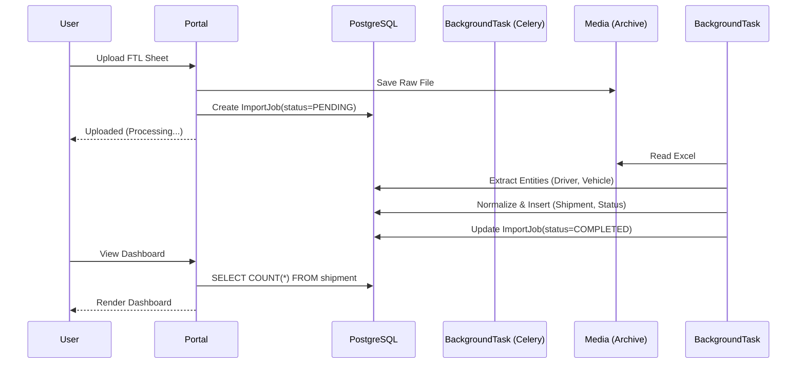

# Operational Data Architecture

This document outlines the proposed Phase 2 architectural transition for EcoFleet Express's operational data.

## 1. Domain Diagrams

### Target PostgreSQL Schema (Entity-Relationship)

## 2. Formal Bounded Contexts

To strictly define architectural boundaries and prevent coupling, the system is separated into the following bounded contexts:

### 2.1 Shipment Context
- **Responsibilities:** Manages the core lifecycle of FTL and BTPL movements from draft to delivery.
- **Ownership:** Owns `Shipment`, `ShipmentStatus`, and `Consignment`.
- **Interactions:** Depends on Fleet Context for `Driver` and `Vehicle` references. Depends on Customer Context for `Receiver` references.

### 2.2 Fleet Context
- **Responsibilities:** Manages master data regarding physical logistical assets and human operators.
- **Ownership:** Owns `Vehicle` and `Driver`.
- **Interactions:** Referenced heavily by Shipment Context. Provides UAN numbers to the HR Context.

### 2.3 Human Resources (HR) Context
- **Responsibilities:** Manages employee presence, compliance, and payroll generation data.
- **Ownership:** Owns `AttendanceRecord`.
- **Interactions:** Depends on Fleet Context (for Driver ID/UAN). 

### 2.4 Customer Context
- **Responsibilities:** Manages client master data, billing entities, and destination addresses.
- **Ownership:** Owns `Customer`.
- **Interactions:** Read-only reference by the Shipment Context for invoicing and consignment delivery.

### 2.5 Import Context
- **Responsibilities:** Translates external Excel payloads into internal Domain entities. Handles data validation, duplicate detection, and fuzzy-matching logic.
- **Ownership:** Owns `ImportJob`, `ImportErrorRecord`.
- **Interactions:** Calls into all other contexts to create or update entities based on external data.

### 2.6 Export Context
- **Responsibilities:** Serializes internal Domain entities into compliance-heavy Excel formats for external vendors.
- **Ownership:** No core business entities; owns only serialization logic.
- **Interactions:** Read-only access across all contexts.

### 2.7 Reporting / Analytics Context
- **Responsibilities:** Aggregates data for the Operations Center dashboard.
- **Ownership:** Owns caching mechanisms and pre-calculated materialized views (if necessary in future).
- **Interactions:** Issues massive `JOIN` queries across Shipment, Fleet, and HR Contexts.

## 3. Rich Domain Ownership

### `Shipment` (Aggregate Root - Shipment Context)
- **Purpose:** Represents a physical journey of goods from origin to destination.
- **Lifecycle:** Created upon Import. Mutated through Status Updates. Archived upon Delivery.
- **Invariants:** Must have a valid `Driver` and `Vehicle` assigned before transitioning to `DISPATCHED`. Expected ETA must be > Dispatch Time.
- **Value Objects:** `RouteCoordinates`, `ExpectedETA`.

### `Driver` (Aggregate Root - Fleet Context)
- **Purpose:** Represents the human operator of a vehicle.
- **Lifecycle:** Created during onboarding (or via Master Data Import). Soft-deleted if terminated.
- **Invariants:** Cannot be assigned to two active `Shipment`s simultaneously.
- **Value Objects:** `LicenseInfo`.

### `AttendanceRecord` (Aggregate Root - HR Context)
- **Purpose:** Tracks the daily operational presence of a driver/employee.
- **Lifecycle:** Created daily via Attendance Import. Immutable after 48 hours for payroll lock.
- **Invariants:** Only one record per `Driver` per `Date`.

### `ImportJob` (Aggregate Root - Import Context)
- **Purpose:** Manages the lifecycle of an asynchronous Excel parsing task.
- **Lifecycle:** Created -> Pending -> Running -> Completed/Failed.
- **Invariants:** Total Rows must equal Processed Rows + Failed Rows upon completion.

## 4. Data Flow Transition

### 2.1 Current Architecture (Phase 1)
Data flow is constrained by file-locking and synchronous operations.

### 2.2 Proposed Architecture (Phase 2 -> Phase 3)
Data flow is decoupled, asynchronous, and ACID-compliant.

## 5. Workbook Lifecycle Migration

1. **Active (Legacy):** Excel files dictate state. Edited continuously by the system.
2. **Import-Only (Future):** Excel files are parsed *once*. If corrections are needed, they are made in the PostgreSQL-backed UI, or a completely new corrected sheet is uploaded.
3. **Export-Only (Future):** `.xlsx` is generated on-the-fly from PostgreSQL for vendor compliance and historical HR payroll records.

## 6. Migration Strategy

- **Stage 1 (Shadow Write):** The UI reads from Excel. We deploy the Importer to parse incoming Excel uploads into PostgreSQL behind the scenes.
- **Stage 2 (Dual Check):** Nightly scripts compare the aggregated state of Excel (e.g., total active drivers) against PostgreSQL table counts. Any mismatch flags an `ImporterError`.
- **Stage 3 (Read Transition):** `ShipmentService` interfaces in `core.operations` are re-wired to read from PostgreSQL via Django ORM.
- **Stage 4 (Deprecation):** Direct Excel `wb.save()` mechanisms are deleted. The system is fully transitioned.
